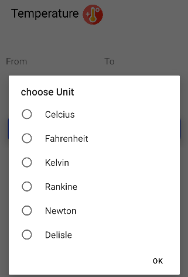
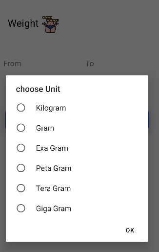
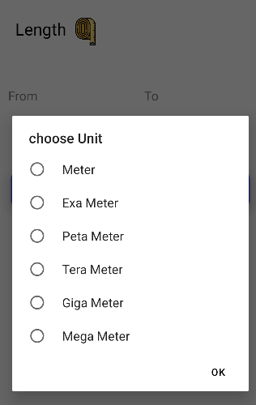
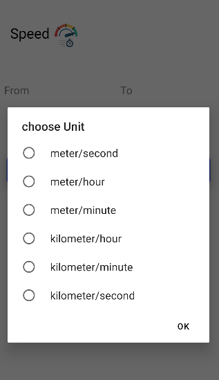
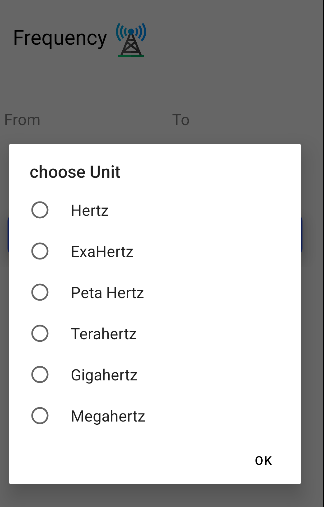
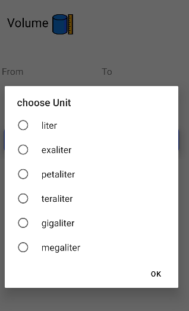

# Unit Converter

An Android application to convert units across different categories: Temperature, Weight, Length, Speed, Frequency, and Volume. This project is built using Android Studio.

##Table of Contents
- [Features](#features)
- [Screenshots](#screenshots)
- [Contact](#contact)

## Features
- **Temperature Conversion:** Convert between Celsius, Fahrenheit, and Kelvin.
- **Weight Conversion:** Convert between kilograms, grams, pounds, and ounces.
- **Length Conversion:** Convert between meters, kilometers, miles, yards, feet, and inches.
- **Speed Conversion:** Convert between meters per second, kilometers per hour, miles per hour, and knots.
- **Frequency Conversion:** Convert between Hertz, kilohertz, megahertz, and gigahertz.
- **Volume Conversion:** Convert between liters, milliliters, gallons, quarts, and pints.

## Screenshots








### Prerequisites
- Android Studio 4.0 or later
- Java JDK 8 or later

### Clone the Repository
```bash
git clone https://github.com/LaahiriTalluri/Unit-converter-_.git

